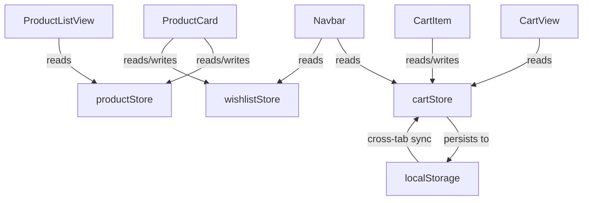

# Shopping Cart

A modern e-commerce shopping cart application built with Vue 3, featuring product browsing, cart management, wishlist functionality, and persistent storage with cross-tab synchronization.

## Table of Contents

- [Features](#features)
- [Tech Stack](#tech-stack)
- [Quick Start](#quick-start)
- [Project Structure](#project-structure)
- [Architecture](#architecture)
- [Available Scripts](#available-scripts)
- [Configuration](#configuration)
- [Recommended Setup](#recommended-setup)
- [Contributing](#contributing)
- [License](#license)

## Features

- **Product Catalogue** — Browse products with category filtering, text search (debounced), and sorting (price, name)
- **Shopping Cart** — Add/remove items, adjust quantities, real-time price calculations
- **Wishlist** — Save favourite products with instant toggle functionality
- **Persistent Storage** — Cart data persists across page reloads via localStorage with schema migration
- **Cross-Tab Sync** — Cart changes synchronize automatically across browser tabs
- **Promo Codes** — Apply discount codes with order summary calculations
- **Responsive Design** — Mobile-first UI with Tailwind CSS
- **Reactive State** — Pinia stores with composition API for predictable state management

## Tech Stack

| Category | Technology | Version |
|----------|-----------|---------|
| Framework | Vue 3 (Composition API) | ^3.5.40 |
| Build Tool | Vite | ^8.1.5 |
| State Management | Pinia | ^4.0.2 |
| Routing | Vue Router | ^4.6.4 |
| Styling | Tailwind CSS | ^4.3.3 |
| Linting | ESLint + oxlint | ^10.7.0 / ~1.74.0 |
| Formatting | Prettier | 3.9.5 |
| Package Manager | pnpm | — |

## Quick Start

### Prerequisites

- Node.js ^22.18.0 || >=24.12.0
- pnpm (install globally: `npm install -g pnpm`)

### Installation

```bash
pnpm install
```

### Development

```bash
pnpm dev
```

The application will be available at `http://localhost:5173` (default Vite port).

### Production Build

```bash
pnpm build
```

Output is written to `dist/`.

### Preview Production Build

```bash
pnpm preview
```

## Project Structure

```
shopping-cart/
├── src/
│   ├── App.vue                 # Root component with Navbar + RouterView
│   ├── main.js                 # Application entry point
│   ├── assets/                 # Static assets (CSS, images)
│   ├── components/             # Reusable UI components
│   │   ├── CartItem.vue        # Single cart line-item with quantity controls
│   │   ├── Navbar.vue          # Global navigation with badge counts
│   │   └── ProductCard.vue     # Product display card with wishlist/cart actions
│   ├── composables/            # Vue composition functions
│   │   └── useCartPersistence.js  # localStorage persistence with migration
│   ├── router/                 # Vue Router configuration
│   ├── stores/                 # Pinia state stores
│   │   ├── cartStore.js        # Cart state, persistence, batch operations
│   │   ├── productStore.js     # Product catalogue, filtering, search
│   │   └── wishlistStore.js    # Wishlist state (Set-based)
│   ├── utils/                  # Utility functions
│   └── views/                  # Route-level page components
│       ├── CartView.vue        # Shopping cart page with order summary
│       ├── ProductListView.vue # Product listing with filters
│       └── WishlistView.vue    # Saved items page
├── public/                     # Public static assets
├── index.html                  # HTML entry point
├── vite.config.js              # Vite configuration
├── tailwind.config.js          # Tailwind CSS configuration
├── eslint.config.js            # ESLint configuration
└── package.json                # Dependencies and scripts
```

## Architecture

### State Management

The application uses three Pinia stores following the composition API pattern:



**cartStore** — Manages cart items with debounced localStorage persistence, cross-tab synchronization via the `storage` event, and batch update support to minimize writes.

**productStore** — Stores the product catalogue in a `Map<number, Product>` for O(1) lookups. Provides debounced search, category filtering, and sorting via computed properties.

**wishlistStore** — Tracks wishlisted product IDs using a `Set<number>` for O(1) membership checks. Session-scoped (no persistence).

### Persistence Layer

Cart data is persisted to localStorage with:

- **Schema versioning** — Automatic migration when data structure changes
- **Deep equality checks** — Prevents redundant writes when state hasn't changed
- **Debounced writes** — 300ms delay to batch rapid changes
- **Cross-tab sync** — Listens to `storage` events to synchronize across tabs
- **Validation** — Invalid cart items are filtered out during restore

See `src/composables/useCartPersistence.js` for implementation details.

## Available Scripts

| Command | Description |
|---------|-------------|
| `pnpm dev` | Start development server with hot reload |
| `pnpm build` | Build for production (minified) |
| `pnpm preview` | Preview production build locally |
| `pnpm lint` | Run all linters (oxlint + eslint) with auto-fix |
| `pnpm lint:oxlint` | Run oxlint only |
| `pnpm lint:eslint` | Run eslint only with cache |
| `pnpm format` | Format code with Prettier |

## Configuration

### Vite

Configuration is in `vite.config.js`. Key settings:

- Vue plugin for SFC support
- Tailwind CSS plugin
- Vue DevTools integration (development only)
- Path aliases (`@` → `src/`)

### ESLint

Configuration is in `eslint.config.js`. Extends:

- `eslint:recommended`
- `plugin:vue/vue3-recommended`
- `prettier` (disables conflicting rules)
- `oxlint` (integrates oxlint rules)

### Tailwind CSS

Configuration is in `tailwind.config.js`. Custom theme includes:

- Custom color palette (primary, secondary, surface, border, danger, success)
- Custom fonts (display, sans)
- Extended spacing and border radius

## Recommended Setup

### IDE

[VS Code](https://code.visualstudio.com/) + [Vue (Official)](https://marketplace.visualstudio.com/items?itemName=Vue.volar) (disable Vetur if installed).

### Browser

**Chromium-based browsers (Chrome, Edge, Brave):**
- [Vue.js devtools](https://chromewebstore.google.com/detail/vuejs-devtools/nhdogjmejiglipccpnnnanhbledajbpd)
- [Turn on Custom Object Formatter in Chrome DevTools](http://bit.ly/object-formatters)

**Firefox:**
- [Vue.js devtools](https://addons.mozilla.org/en-US/firefox/addon/vue-js-devtools/)
- [Turn on Custom Object Formatter in Firefox DevTools](https://fxdx.dev/firefox-devtools-custom-object-formatters/)

## Contributing

1. Fork the repository
2. Create a feature branch: `git checkout -b feature/amazing-feature`
3. Make your changes
4. Run linting: `pnpm lint`
5. Commit your changes: `git commit -m 'Add amazing feature'`
6. Push to the branch: `git push origin feature/amazing-feature`
7. Open a Pull Request

Please ensure your code follows the existing style conventions and passes all lint checks.

## License

This project is private and proprietary.

---

**Built with** [Vue 3](https://vuejs.org/), [Vite](https://vite.dev/), and [Tailwind CSS](https://tailwindcss.com/).
